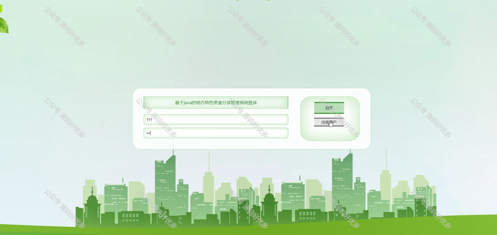
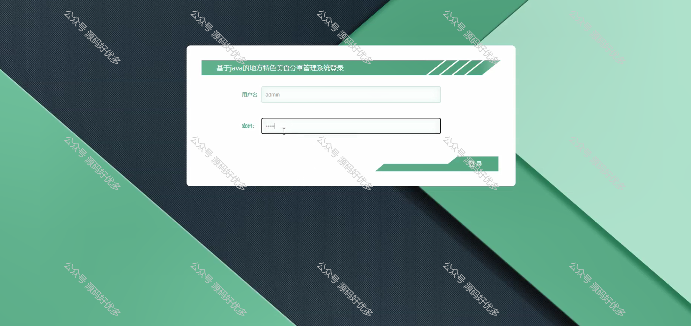

 
## 查看主页获取源码

### 一、作品包含

源码+数据库+设计文档万字+PPT+全套环境和工具资源+部署教程

### 二、项目技术

前端技术：Html、Css、Js、Vue、Element-ui

数据库：MySQL

后端技术：Java、Spring Boot、MyBatis

  

### 三、运行环境

开发工具：IDEA/eclipse

数据库：MySQL5.7

数据库管理工具：Navicat10以上版本

环境配置软件： JDK1.8+Maven3.6.3

前端Nodejs：14

### 四、项目介绍
项目编号：springbootA252

地方特色美食分享管理系统作为一个专注于美食分享的平台，旨在汇聚各地特色美食资源，为美食爱好者提供一个交流和探索美食文化的空间。该系统通过整合各地美食信息，为用户带来丰富的美食体验，同时也促进了美食文化的传播和交流。通过这样的方式，地方特色美食分享管理系统不仅丰富了用户的美食生活，也为地方特色美食文化的传承和发展做出了积极贡献。

前台用户功能：浏览首页、美食菜谱、美食信息、美食论坛、系统公告、个人中心。

后台管理员的功能：系统首页、个人中心、用户管理、美食菜谱管理、菜谱分类管理、美食信息管理、美食分类管理、美食论坛、系统管理。

### 五、运行截图

  
